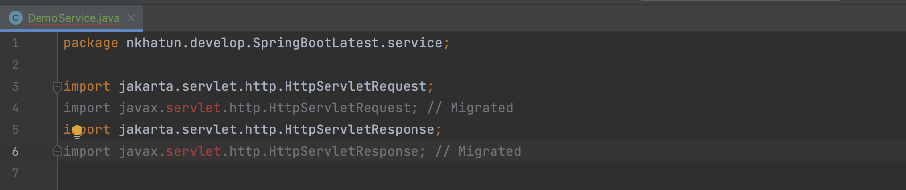

# 😇 SpringBoot3.0Features

Latest version of spring boot, released on Nov 24 2022&#x20;

## Features

* Java 17 baseline and java 19 support

* Migrated Java EE to Jakarta EE APIs for all dependencies

* Elastic Search Java Client
* Spring Framework 6 Support

Spring boot 3.0 builds on and requires Spring farmework 6.

[spring-framework-6-features.md](readme/spring-framework-6-features.md "mention")

* GraalVM Baseline and Native build tools plugin
* Prometheus support
* Upgraded Third Party jars to latest stable release
* Log4j2 Enhancements
* Micrometer Updates
* Improved @ConstructorBinding Detection
* More flexible Auto-configuration for Spring Data JDBC
* Auto-configuration for JdkClientHttpConnector
* @SpringBootTest with Main Methods

